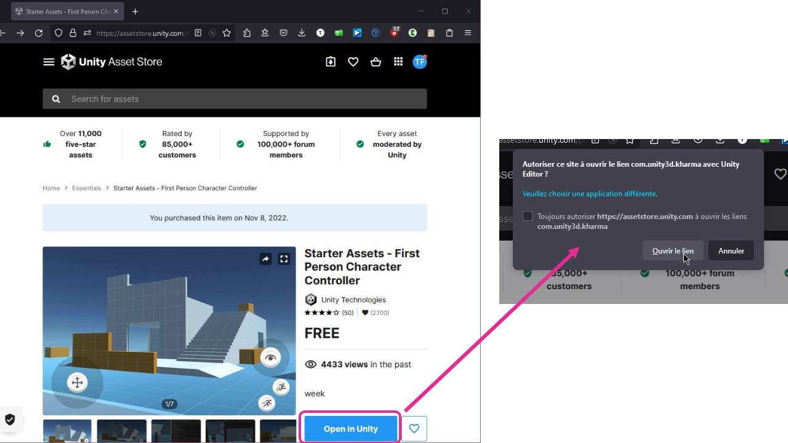
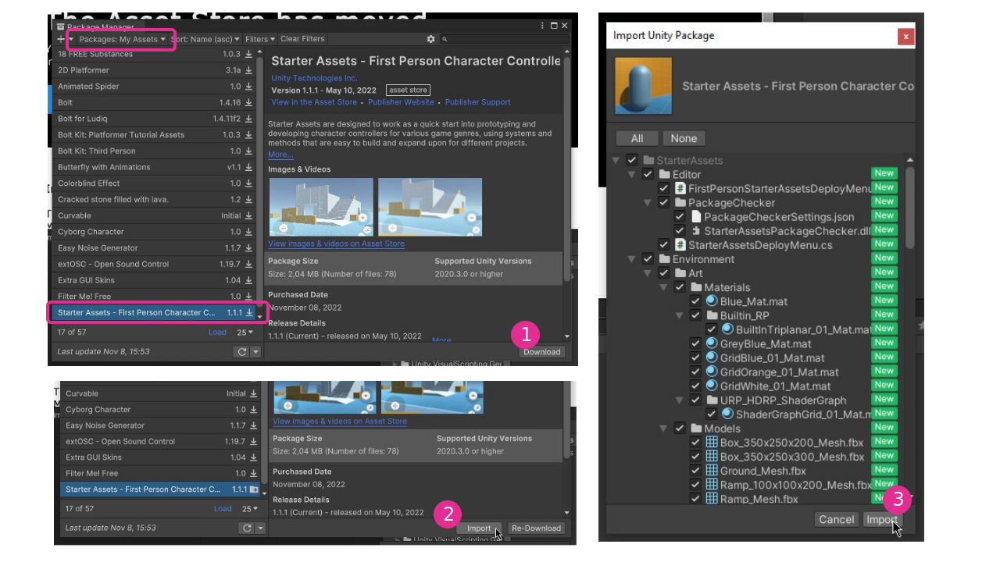
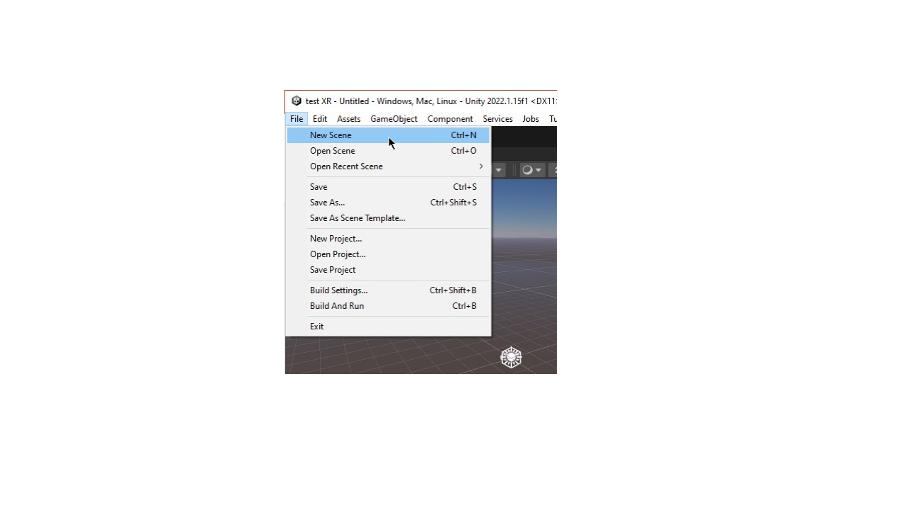
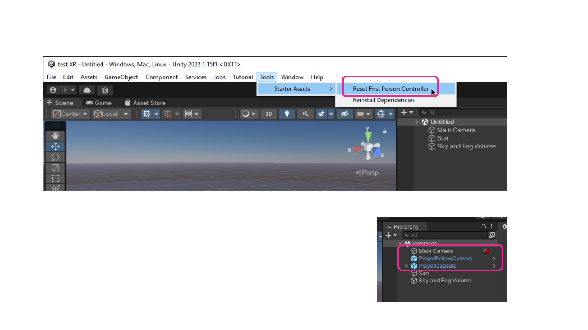
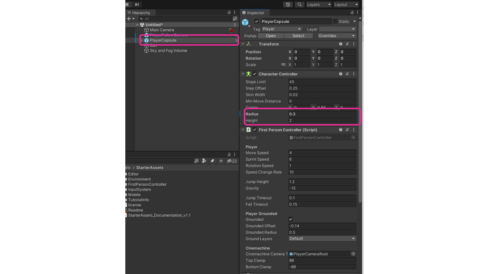
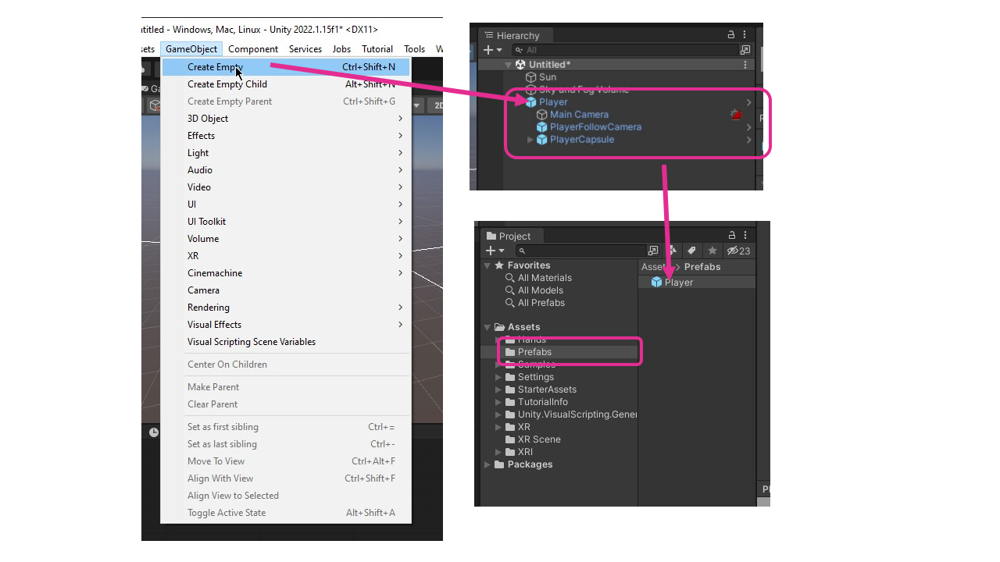
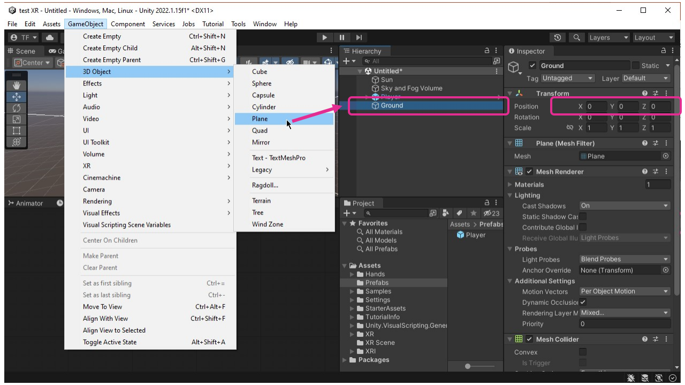

# Contrôleur de personnage (FPS, Third Person)

Ces instructions utilisent le paquet suivant : [Starter Assets - First Person Character Controller | Essentials | Unity Asset Store](https://assetstore.unity.com/packages/essentials/starter-assets-first-person-character-controller-196525)

