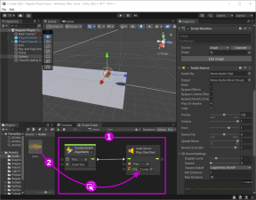

# Déclencher un son

## Préalable : configurer un déclencheur

Il faut avant tout un évènement qui déclenche la lecture du son. Par exemple, lorsque le Game Object entre en collision avec un Collider.

Dans la figure suivante, nous avons configuré le déclenchement de l'évènement «Jouer Son» lorsque le Game Object entre en collision avec un Collider.

## Configuration et code

