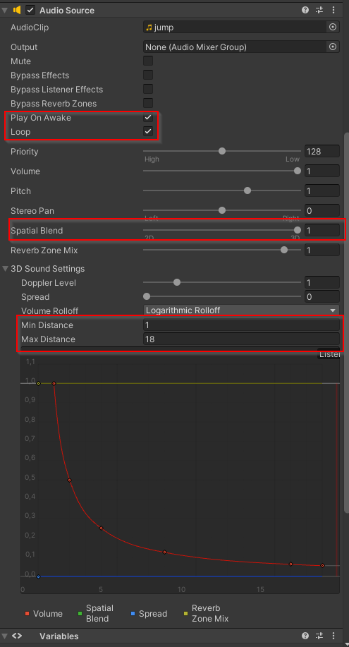
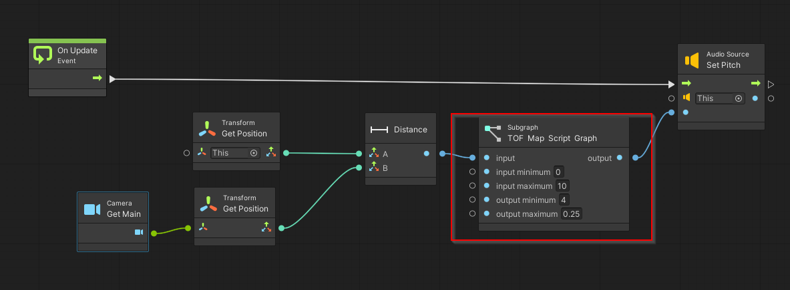
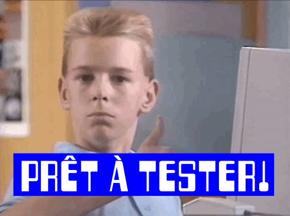

# Vitesse d'un son selon la proximité

## Préalables

Téléchargez le graphe pour le [mappage de données](./map/map.md)

## Configuration de la source sonore

## Ajout du graphe sur la source sonore

