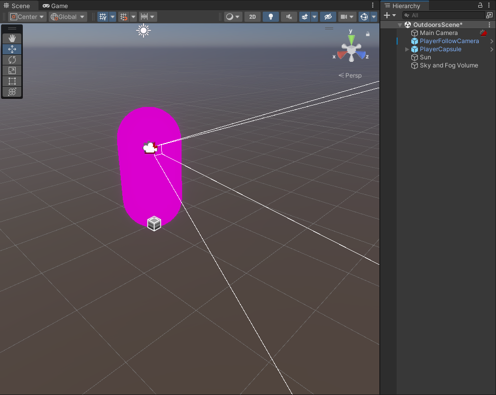
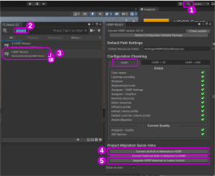

# Réparer les matériaux magentas

## Le problème magenta

Il arrive parfois lors de l'importation de paquets ou de modèles que le matériau s'affiche en magenta dans la fenêtre de scène. Cela indique un problème avec le *Shader* du matériau. 

## Réparation du problème avec le «HDRP Wizard»

