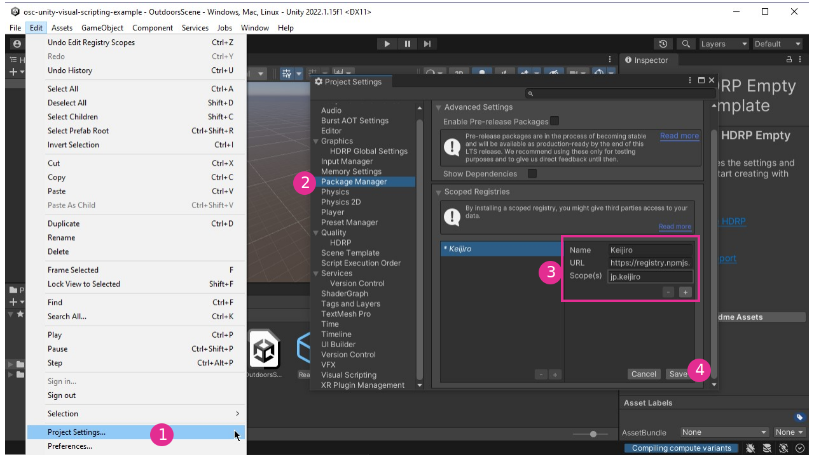
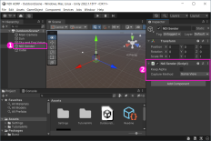
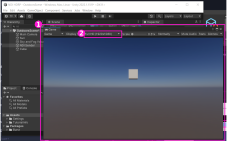
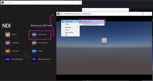

# KlakNDI de Keijiro

KlakNDI permet d'envoyer l'image de la scène, de la caméra ou d'une texture par NDI.

## Installation dans Unity

Pour installer [KlakNDI](https://github.com/keijiro/KlakNDI) de Keijiro nous evons l'ajouter dans la liste de paquets.

Voici l'information à inscrire dans les paramètres du gestionnaire de paquets (voir figure ci-bas) :
* Name: `Keijiro`
* URL: `https://registry.npmjs.com`
* Scope: `jp.keijiro`

## Ajout à la scène

## Configuration de la Game Window

La «Game Window» doit toujours être visible si vous voulez que le flux NDI soit mise à jour. Si elle est cachée, le flux NDI sera pausé. Il est donc recommandé de :
* Détachez la fenêtre «Game Window»
* Vérouillez la résolution de la «Game Window»

## Tester avec le «Studio Monitor» de NDI Tools

