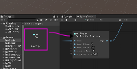

# Mappage de données

Unity ne possède pas de fonction de base pour le mappage des données comme dans Max (avec l'objet scale) ou Arduino (avec la fonction map). Ci-bas, vous trouvez un Script Graph vous permettant de reproduire les fonctionnalités de [[scale]](https://docs.cycling74.com/max8/refpages/scale) ou [map](https://www.arduino.cc/reference/en/language/functions/math/map/). 

