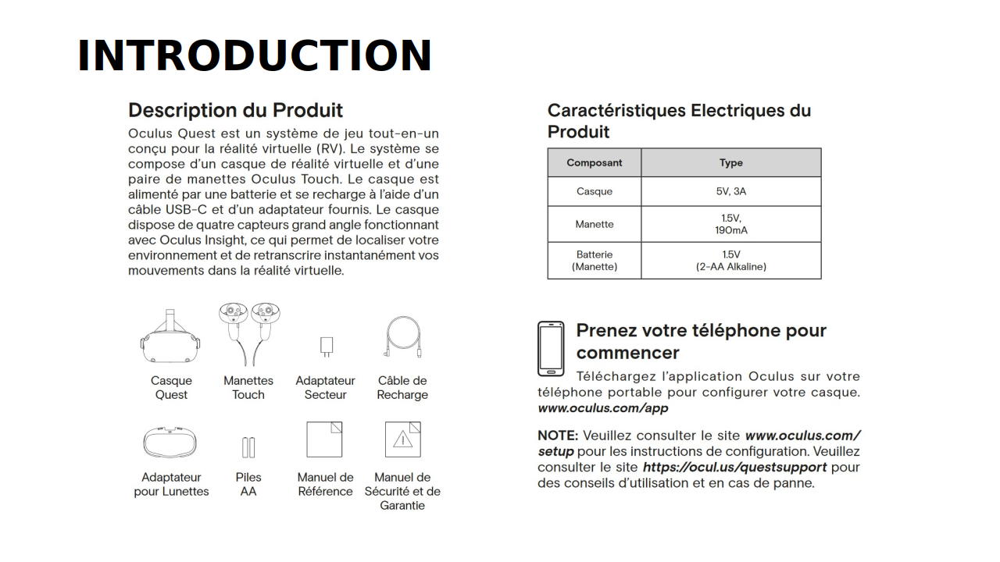
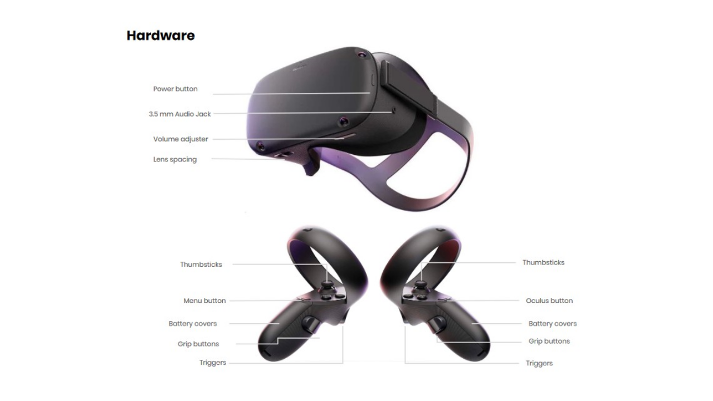
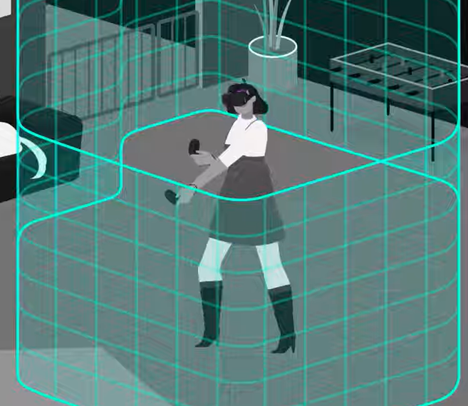
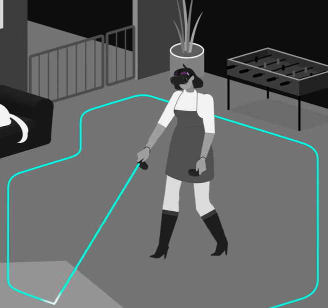
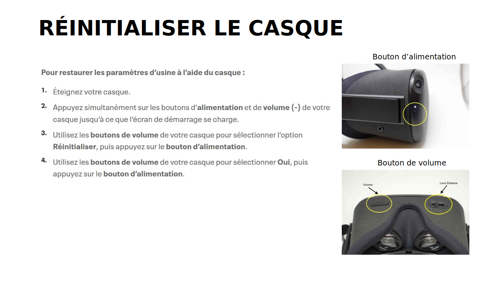

# Introduction au casque Quest

## Modes de jeu Guardian

Votre sécurité physique est importante lorsque vous utilisez votre casque Oculus. C’est pourquoi vous devez configurer une limite Guardian. Les modes de jeu Guardian indiquent la taille de la zone de jeu requise pour l’expérience et le degré de mouvement physique nécessaire au jeu.

### Guardian Roomscale

Guardian Roomscale permet de définir une limite virtuelle qui vous aidera à rester dans une zone de jeu dégagée. Elle apparaîtra dans votre expérience VR si vous vous approchez trop près du bord de la zone de jeu définie.

Lorsque vous configurez votre limite Guardian, laissez de l’espace entre les murs et votre zone de jeu et autour des objets. Gardez à l’esprit que Guardian n’est pas en mesure de détecter des gens ou des animaux qui entrent dans votre zone de jeu; choisissez donc une zone que vous pouvez maintenir dégagée, même lorsque vous portez le casque.

### Guardian stationnaire

Le mode  **stationnaire** peut être utilisé pour les zones de jeu plus réduites où votre corps ne se déplcara pas beaucoup dans l'espace. Nous vous recommandons d’utiliser une limite Guardian stationnaire pour les modes de jeu assis et debout.

* [https://www.oculus.com/safety-center/quest/](https://www.oculus.com/safety-center/quest/)

## Santé et sécurité

Dégagez toujours la zone de jeu avant d’enfiler votre casque. Vérifiez tout obstacle que vous seriez susceptible de heurter même les bras ouverts. Lorsque vous configurez votre limite Guardian, laissez de l’espace entre les murs et votre zone de jeu et autour des objets. Gardez à l’esprit que Guardian n’est pas en mesure de détecter des gens ou des animaux qui entrent dans votre zone de jeu; choisissez donc une zone que vous pouvez maintenir dégagée, même lorsque vous portez le casque

* [https://www.oculus.com/safety-center/quest/](https://www.oculus.com/safety-center/quest/)

