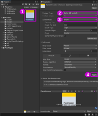

# Importation d'images pour UI en 3D

## Problème : les images importées ne sont pas disponibles pour les interfaces utilisateur

Lorsque nous travaillons dans un projet 3D, Unity importe par défaut les images en tant que **texture**. Cependant, les textures ne peuvent être utisées pour les interfaces utilisateur (UI).

## Solution : importer les images en tant que Sprite

Pour pouvoir utiliser  ces images dans des interfaces utilisateur (UI) nous devons forcer l'important des images en tant que **Sprite**.

