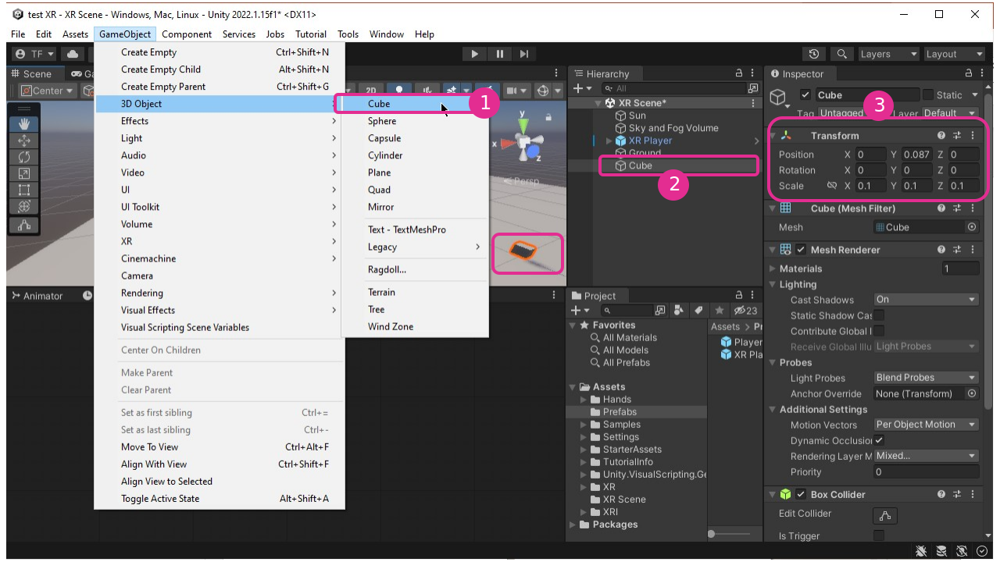

# Objets attrapables(Grabbable)

## Ajouter un objet à attraper

## Script «XR Grab Interactable»

## Vidéo complémentaire

[ATTRAPER DES OBJETS AVEC SES «MAINS LASERS» - YouTube](https://www.youtube.com/watch?v=5t906sblqHw)