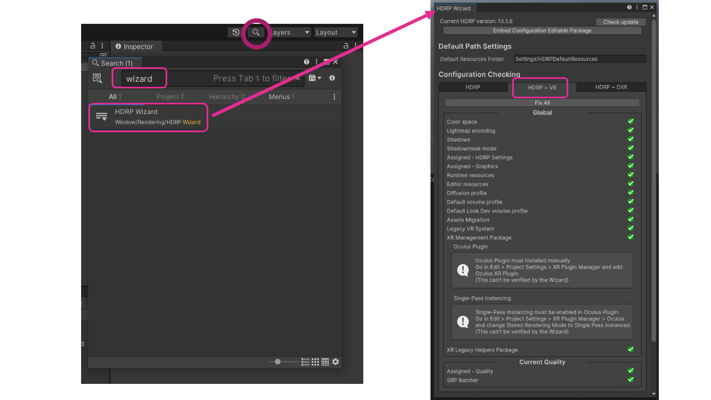
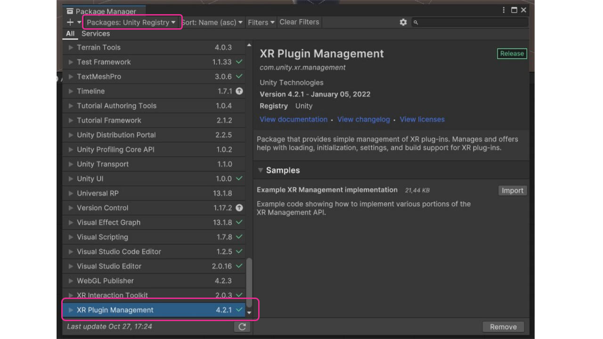
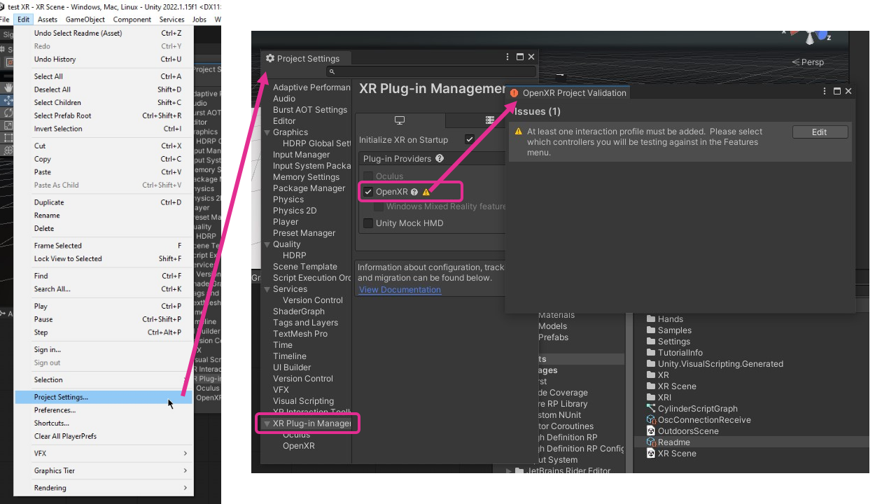
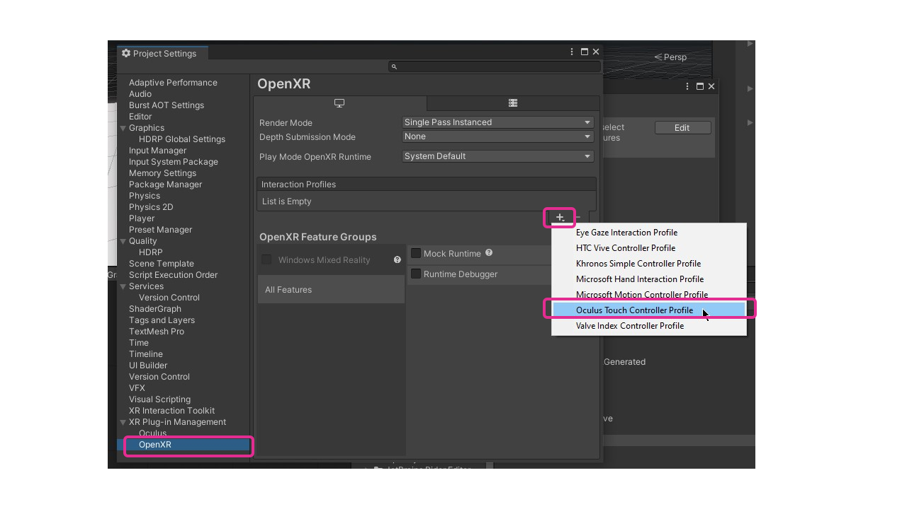
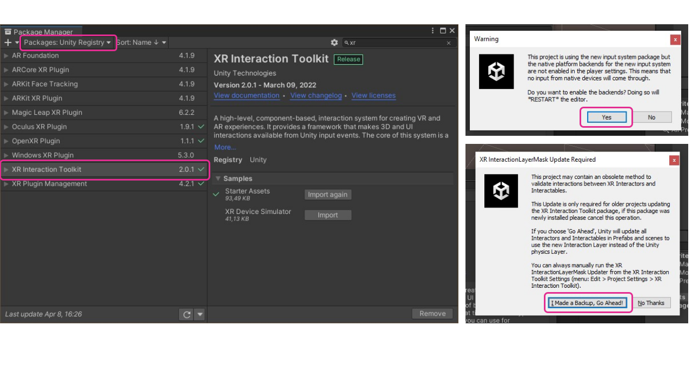
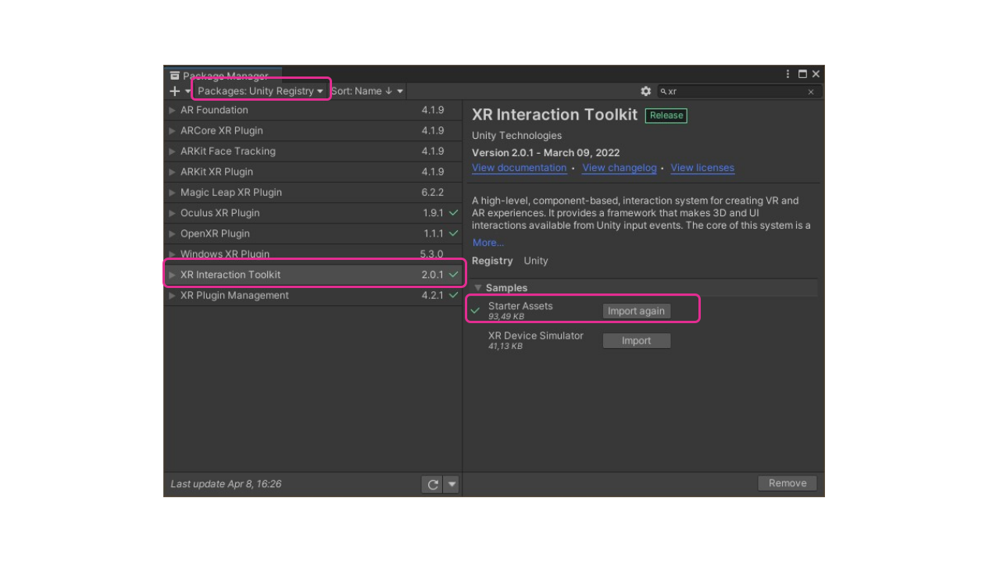
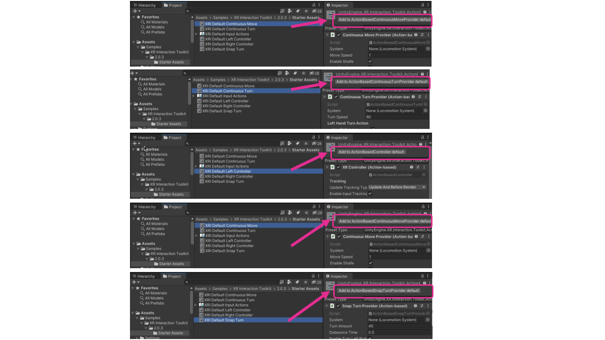
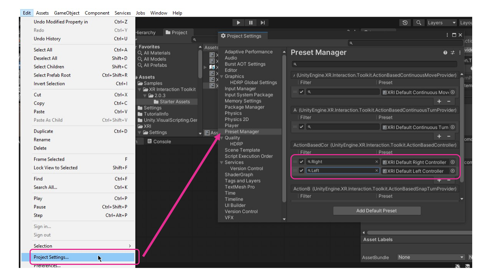

# Ajouter XR à un projet HDRP

## Préalables

Avant de commencer, assurez-vous de [démarrer un projet HDRP](../hdrp/hdrp.md).

## «HDRP Wizard»

## Paquet XR Plugin Manager

## XR Interaction Toolkit

## Preset Manager

