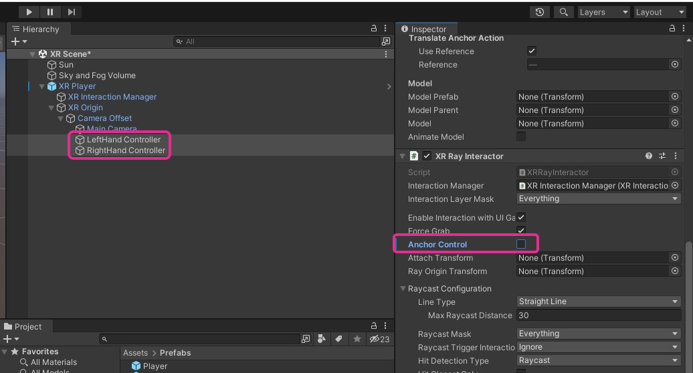

# Locomotion en XR

## Désactivation de la rotation des objets tenus

## Locomotion continue avec la manette de la main gauche

## «Ground Plane»

## Vidéo complémentaire

* [Part 5: Movement in VR and Unity Character Controller - How to Make a VR Game - YouTube](https://www.youtube.com/watch?v=UoSeew6qahY)

