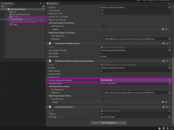
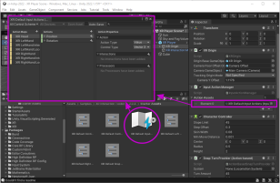
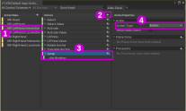
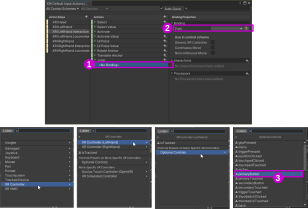
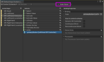
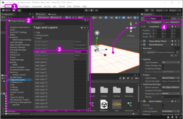
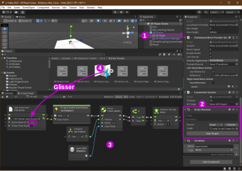
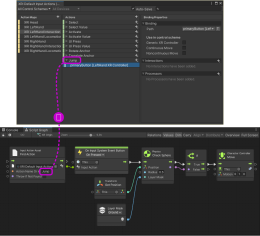

# Ajouter le saut à la locomotion de base

## Préalable

* Avoir la locomotion de base fonctionnelle : [Locomotion de base avec les manettes de pouce](./xr_locomotion/xr_locomotion.md)

## Configuration du script «Continuous Move Provider» du «XR Origin»

## Configuration de l'action de saut dans «XRI Default Input Actions» 

## Ajout et assignation du Layer «Ground»

## Ajout du Script Graph de saut au «XR Origin»

 

 

