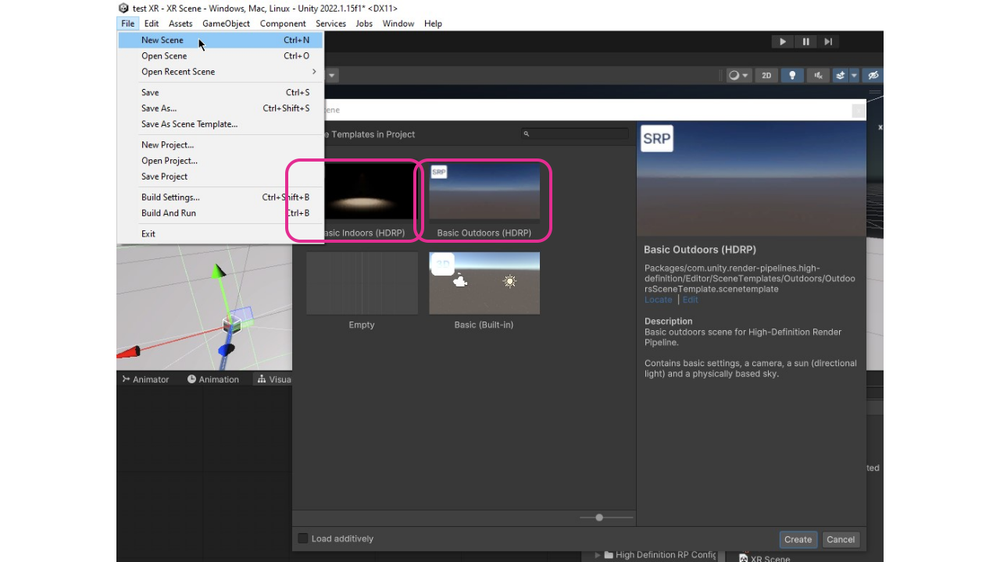
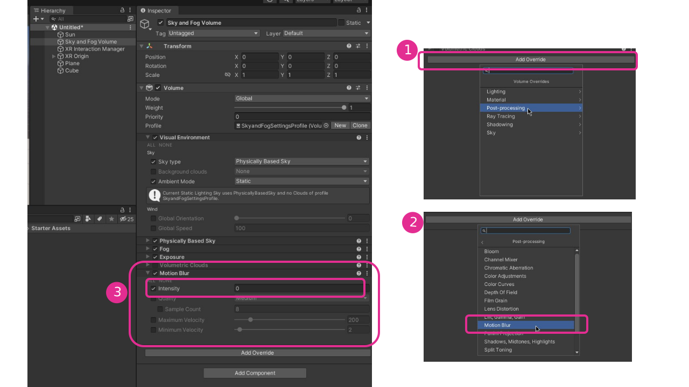
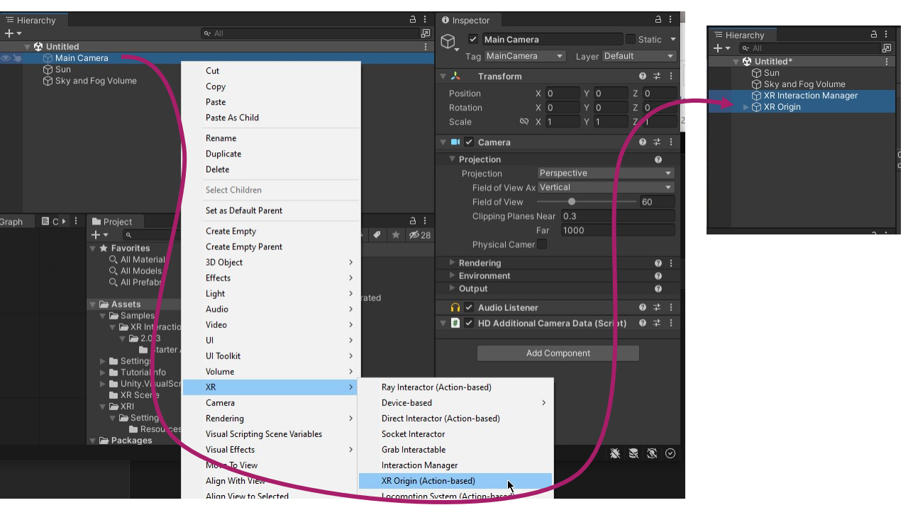
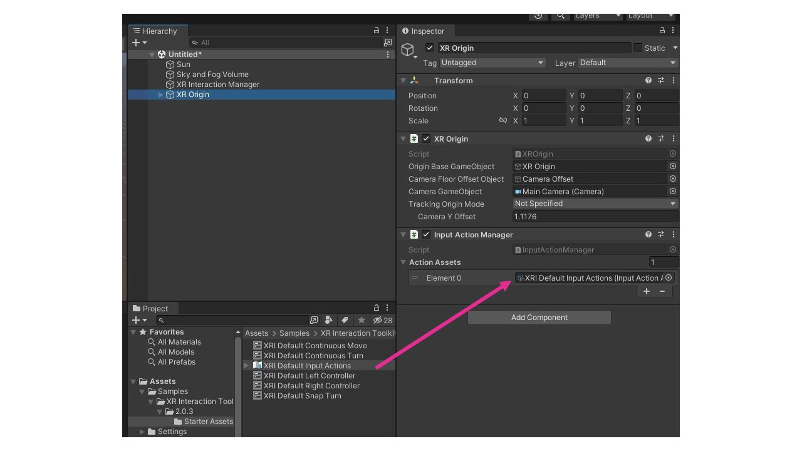
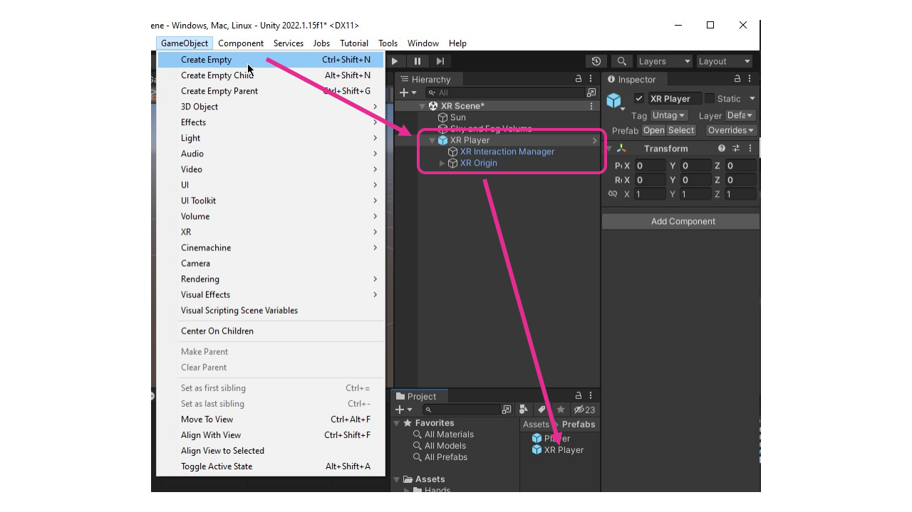

# Créer une scène XR HDRP

## Préalables

Avant de commencer, assurez-vous que vous avez suivie les instructions de la section [Support XR en HDRP](./xr_introduction/xr_introduction.md).

## «Action Based» ou «Device Based»

Il existe souvent 2 versions (ou plus) des Scripts ou Components pour la XR. En cas de doute, choisissez la version «Action Based».

## Nouvelle scène

## «Sky and Fog Volume» et «Motion Blur» 

## XR Origin

## XRI Default Input Actions

## Prefab XR

