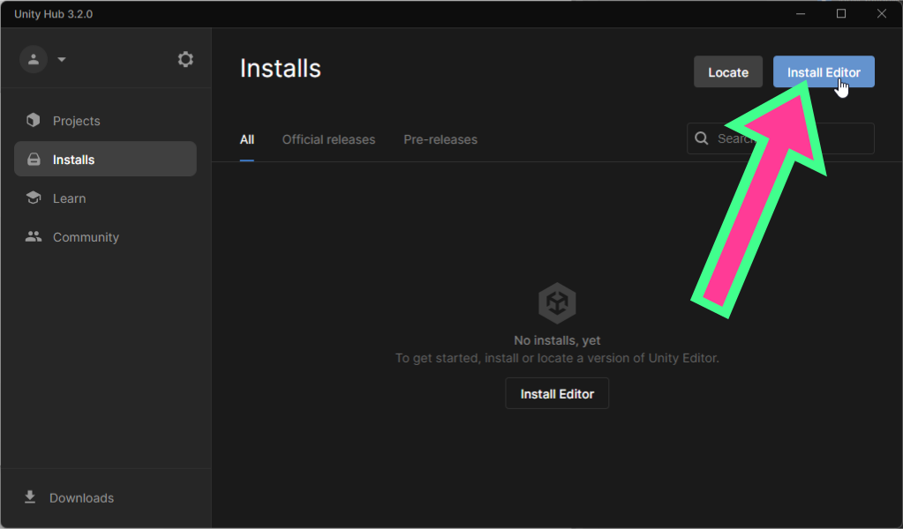
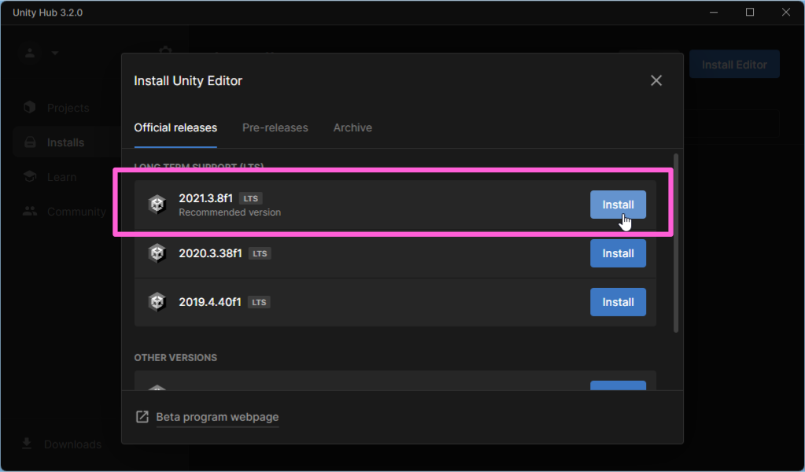
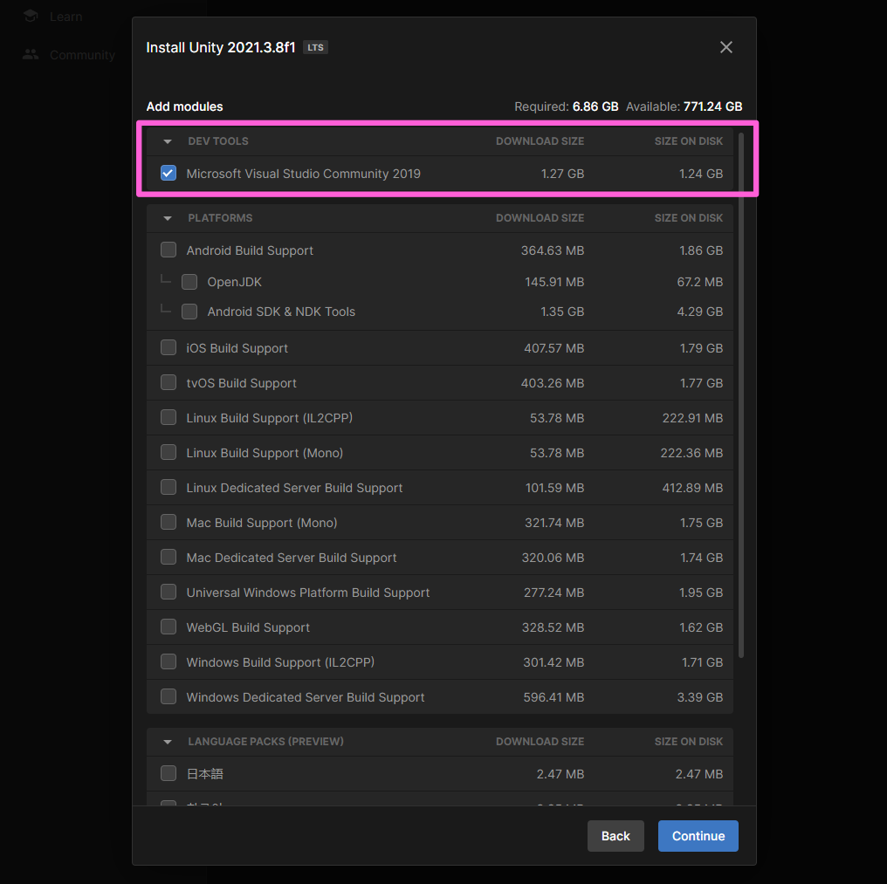
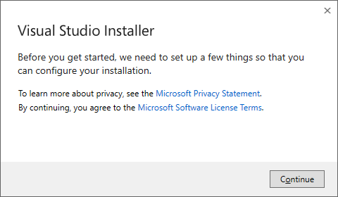
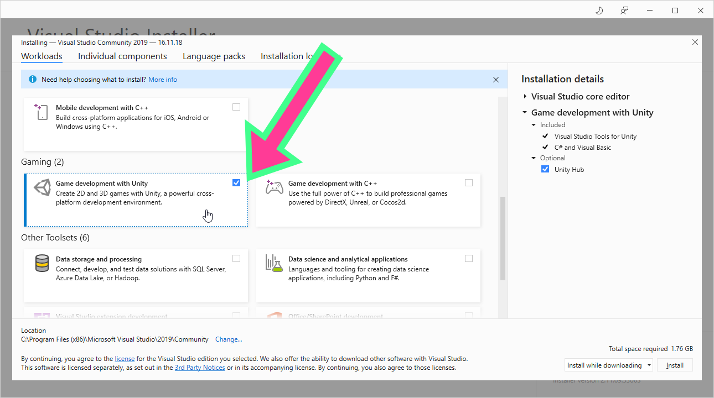
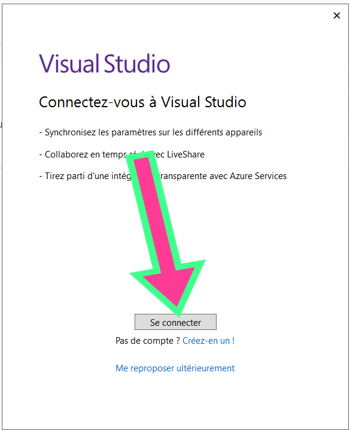
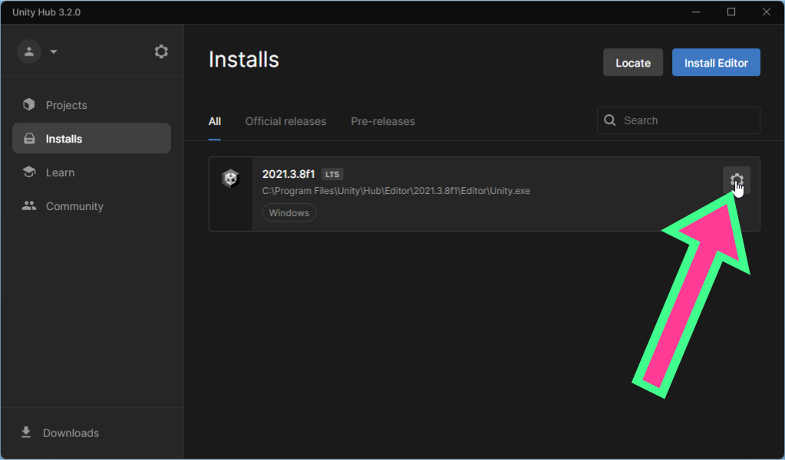

# Créez un compte sur Unity.com

# Téléchargez Unity Hub du site Web

Rendez-vous à la page [https://unity.com/fr/download](https://unity.com/fr/download) pour télécharger Unity Hub.

# Installation de Unity Engine

## Ouvrez Unity Hub et installez Unity Editor 2021

Si Unity Hub ne vous propose pas l'installation de Unity Editor à l'ouverture, vous devez installer Unity Editor manuellement.

## Installation de Visual Studio

Le démarrage de Visual Studio devrait commencer immédiatement après l'installation de Unity Engine.

## Installation du paquet de support pour Unity

## Connectez vous à votre compte Microsoft ou scolaire

## Après l'installation, n'ouvrez pas de projet et fermez toutes les fenêtres de Visual Studio

# Modifier une installation d'Unity Engine

Si lors de l'installation de Unity Editor vous avez oublié d'installer des options ou des paquets (comme Visual Studio Community), vous pouvez la modifier en cliquant sur engrenage.

